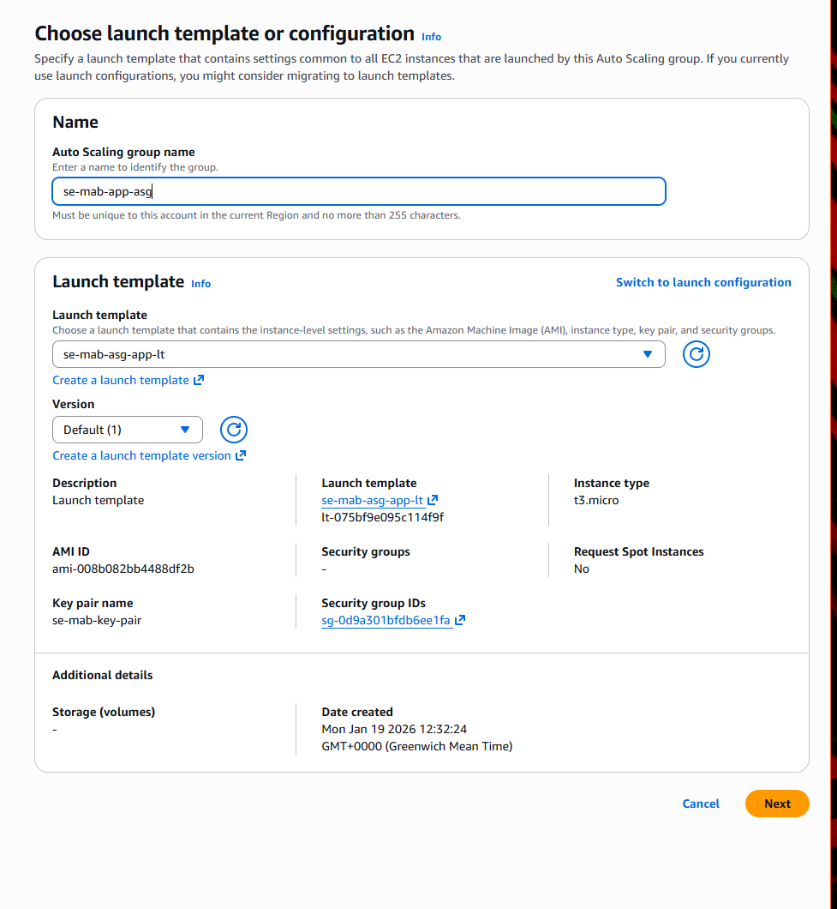
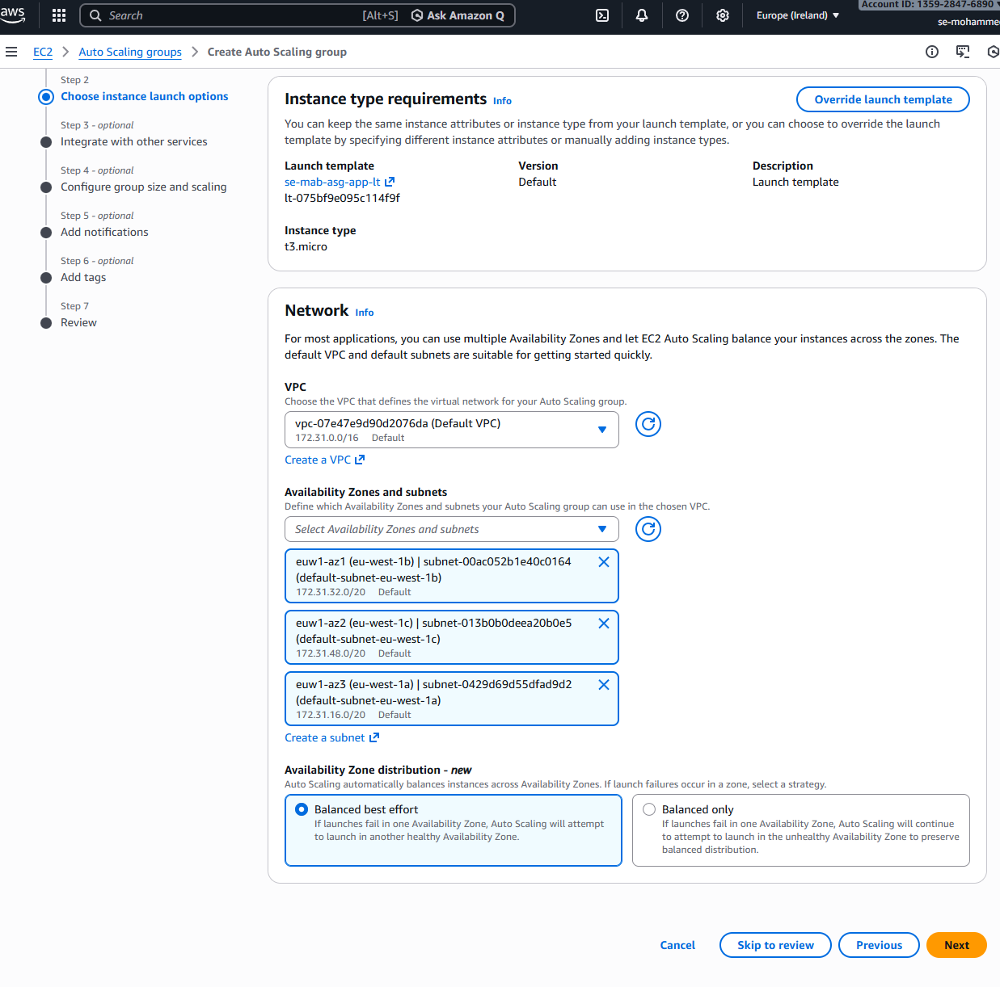
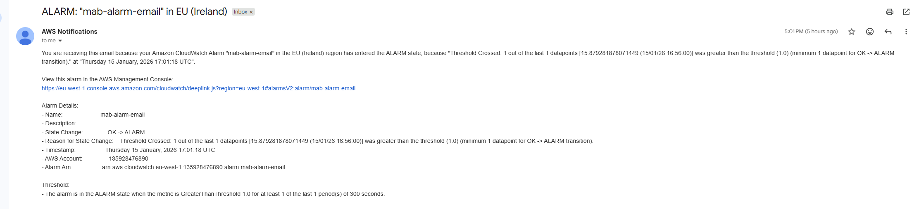
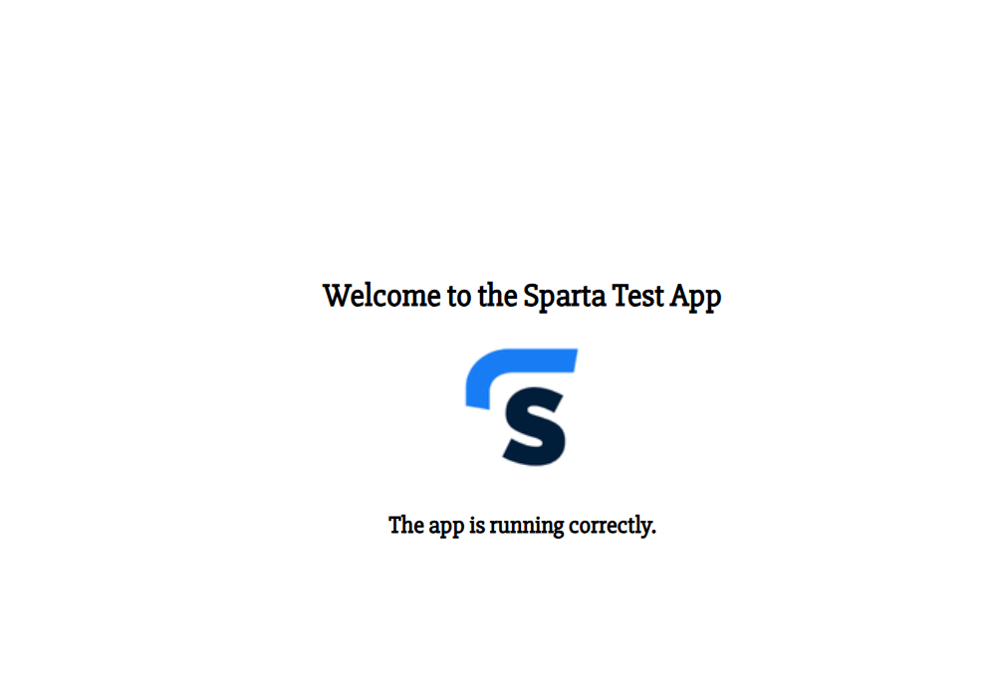

## Automatic Script for connecting app to database 
- Launch a new template in AWS.
- Load the Node20-app machine instance and add the following in the advanced settings

```
#!/bin/bash

sleep 15

cd /home/ubuntu

cd se-sparta-test-app
cd app

export DB_HOST=mongodb://<IP>:27017/posts

sudo npm install

node seeds/seed.js

pm2 start app.js
```

- Launch the mongoDB instaqnce and copy the IPV4 address and add it to the export db_host command 

- Now you have created a New app instance and connected it to the database all automatically through a script

- Now we will look into Auto Scaling and Load Balancing

## Instance templates and Launching an instance template
- First step for this section is to create a new instance template


- In advanced settings add the script

```
#!/bin/bash

sleep 15

cd /home/ubuntu

cd se-sparta-test-app
cd app

export DB_HOST=mongodb://<IP>:27017/posts

sudo npm install

node seeds/seed.js

pm2 start app.js
```
- And create the template and now you can also launch a instance from the template which saves all the details you put in before
 

## Auto Scaling

- Now if you go to Auto Scaling groups and create Auto Scaling Group






- Now you can create the Auto Scaling group and check if its running correctly create go to Load Balancers

- Copy the DNS name and add /posts at the end in order to see your web app and database






- Finished


