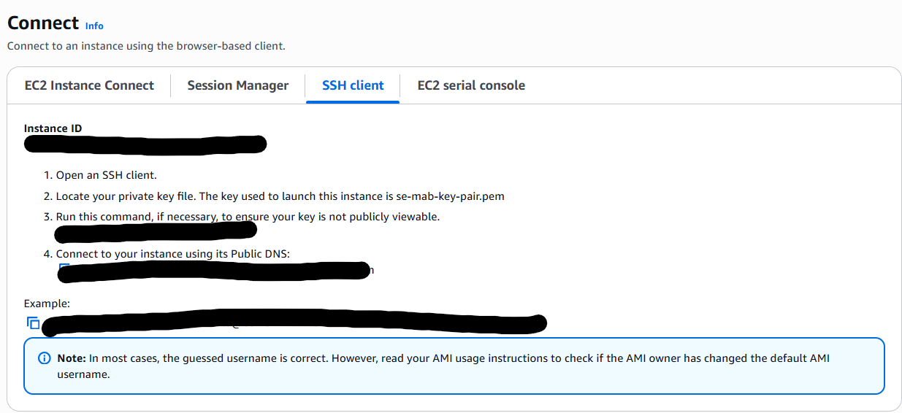

## Database Deployment

### Launching and Connecting to the Instance
- Launch a new instance with the naming convention: *se-first\-name-app*
- Select Ubuntu for AMI and use the keypair you have created initially
- Create new security settings with the naming convention: *se-first\_name-sg*
-click edit 
- SSH into the VM we created using GitBash using the commands in the image below
- use cd .ssh to get into your private key folder or find where u saved it using cd

- use command chmod 400 "se-<name>-key-pair.pem" and ssh -i "se-<name>-key-pair.pem" ubuntu@ec2-<DatabaseIP>.<AWS Region>.compute.amazonaws.com
- Enter yes to fingerprint warnings


### Installing MongoDB version 7
    We have to install all the packages first:
```
sudo apt update && sudo apt upgrade -y
```

    We can now run the following commands: 
```
sudo apt install gnupg curl -y

sudo apt update

curl -fsSL https://www.mongodb.org/static/pgp/server-7.0.asc | sudo gpg -o /usr/share/keyrings/mongodb-server-7.0.gpg --dearmor

echo "deb [ arch=amd64,arm64 signed-by=/usr/share/keyrings/mongodb-server-7.0.gpg ] https://repo.mongodb.org/apt/ubuntu jammy/mongodb-org/7.0 multiverse" | sudo tee /etc/apt/sources.list.d/mongodb-org-7.0.list

sudo apt update

sudo apt install -y mongodb-org=7.0.6 mongodb-org-database=7.0.6 mongodb-org-server=7.0.6 mongodb-mongosh=2.1.5 mongodb-org-mongos=7.0.6 mongodb-org-tools=7.0.6

mongod --version
```

### Setup and Running the database

    Before we can run the database we need to edit the config file so follow this command: 
    
```
cd /etc

sudo nano mongod.conf

change BindIP to  0.0.0.0 
```


    Once that is done now we can restart the Mongodb and check if it is running using these commands: 
```
sudo systemctl restart mongod
```
```
sudo systemctl status mongod
```

    You should see that your database is succesfully active as shown in this image


### Automatic App creation with script

### Create an instance
    Create new instance and use the settings in the image below to create an instance. 


### Connect to Instance
    Once instance is created connect to the instance using the image below: 


    Run the commands from the image in Gitbash in order to connect to your instance. 

### Running the script
    run command in gitbash
```
sudo nano app-deploy.sh
```

    Once command is run you can now paste the script in the open nano file and save it
```
#!/bin/bash

# update packages
sudo apt update -y

# upgrade packages
sudo apt upgrade -y

# install git if it's not there
sudo apt install git -y

# get the app code
git clone https://github.com/LSF970/se-sparta-test-app.git

# install nginx
sudo apt install nginx -y

# install sed
sudo apt install sed -y

# use sed to change nginx config
sudo sed -i '51c\proxy_pass http://127.0.0.1:3000;' /etc/nginx/sites-available/default

# restart nginx
sudo systemctl restart nginx

# enable --> makes the process a startup process
sudo systemctl enable nginx

# install curl
sudo apt install curl -y

# download nodejs 20.x
sudo bash -c "curl -fsSL https://deb.nodesource.com/setup_20.x | bash -"

# install nodejs 20
sudo apt install nodejs -y

# cd into repo
cd se-sparta-test-app

# cd into app folder
cd app

# npm install
sudo npm install

# install pm2 --> process manager for node apps
sudo npm install pm2 -g

# kill all node processes
pm2 kill

# start the app
pm2 start app.js
```

    Save the changes and you can turn permissions on using this command.
```
chmod +x app-deploy.sh
```

    You can run the saved deploy file using command:
```
./app-deploy.sh
```
### Connecting app to the database

     Now the app is running you can add a system variable for the database host using this command and remember to deplace the database ip with your ipv4 from the mongodb instance
```
export DB_HOST=mongodb://<DatabaseIP>:27017/posts
```

    Now you need to run command below:
```
node seeds/seed.js
```

    You should see this message now and it means that the database has been populated


    Then you can start the server using the command below:
```
npm start app.js
```
    Since both instances have been connected and database has been populated, if you go on the ipv4 address from your app instance and add ':3000/posts' to the end of the link you should see this page


    
    


