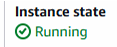
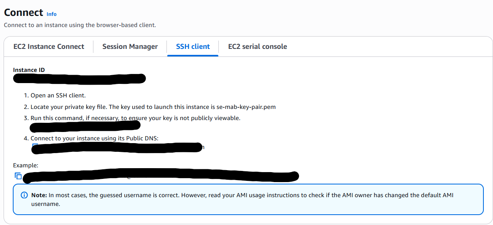

# Instructions for AWS App Deployment - Challenge 1 

## Key pairs and User Folder

    1. Search for EC2 on the AWS console. There is a resource tab in the EC2 where you have to select key pairs.

    2. create a new key pair, with a naming convention that is familiar and easy to find, for example:
    se-name-key-pair

    3. Once the private key is made it will be automatically downloaded to your computer. 
    Once it is downloaded you have to add it to your .ssh folder in your user folder and if the folder does not exist in your user folder you can create a folder called .ssh, for example:
    $cd C:\\Users\\matta\\.ssh

## Launching an Instance
    4. Click on the Launch Instance button on the EC2 dashboard and configure this page with the following steps:

    Name and Tags: follow a naming convention like this se-name-server

    Application and OS images: You have to select Ubuntu and leave the options default which will be Ubuntu 24.04 Free Tier version

    Instance Type: Leave it as default which should be t3.micro

    Key pair (login): this should be the keypair which was assigned initally in step 1.

    Network settings: For the network settings tab, first you have to click edit and change the security group name and description to the standard naming convention like explained in step 1 and 4.

    In the network settings tab, you should add 3 different security group rules and it should look like this:
  
    
    You leave storage settings and advanced details sections as default.

## Connecting to the Instance
    5. Now you can click on launch instance and you will be presented with an instance code.

    After you click on the instance code you will have a screen with the instance summary 
    where you can see that the instance state that you have created and that it is 
    successfully running.

    Then on the instance summary page you need to select the connect button where you will be presented with instructions in order to connect to the instance. 

    Now you are ready to connect to your instance through your computer. You have to open gitbash,and navigate to your directory where you stored the private key.
    
    For example: “C:\\Users\\matta\\.ssh”. 

    Follow the instructions in order to connect to your instance on the aws website. Click the SSH client, you have to run 2 commands from the ssh section on aws website.

    Once in the directory in gitbash you have to save and run the provided script in order to launch nginx webserver onto the instance. 

    You can use nano to do this: 'sudo nano deploy-nginx.sh' and copy the script into this file and save it.

    Script: 
    \#\!/bin/bash  
    \# This script deploys an Nginx server using Docker.  
      
    \# update packages  
    sudo apt update \-y  
      
    \#upgrade packages  
    sudo apt upgrade \-y  
      
    \#get and install nginx  
    sudo apt install nginx \-y  
      
    \#restart nginx service  
    sudo systemctl restart nginx  
      
    \#enable nginx \- make it a startup process for the os  
    sudo systemctl enable nginx  

    You can use this link in order to access the webserver and when you are on the page it 
    might not load so click the link and remove the s from https in order to access the 
    webserver. 

## Transferring zip file
    6. Download the app folder from github and save it in a folder.

    Open a new gitbash file and navigate to the folder you installed the app in and use the command '$ scp \-i \~/.ssh/se-mab-key-pair.pem ./nodejs20-se-test-app-2025.zip ubuntu@34.252.216.212:\~'

    Now if you do ls command you can see that the application file has now been added to your instance 

    Next you have to install unzip and the command for that is sudo apt install unzip and you do this on the ubuntu instance gitbash.

    Then you have to unzip and write the name of your folder on the command line. 'unzip nodejs.zip'

 ## Install NodeJS
    7. Install dedicated version for NodeJS depending on the application through gitbash.

## Install App 
    8. Using CD you are then able to install the app by navigating to app folder in the application using the 'npm install' command on linux.

## Run the App
    9. Use command 'npm start app.js' to deply the app

## Port
    10. Once you are on your webserver you can add the port :3000 at the end in order to access your application page.

# Database Implementation - Challenge 2

step 1: 

Port 27017 new instance rule 

Do all the terminal stuff 

Sudo apt install gnupg curl -y

step 2: 

after gnup curl
curl -fsSL https://www.mongodb.org/static/pgp/server-7.0.asc | \
   sudo gpg -o /usr/share/keyrings/mongodb-server-7.0.gpg \
   --dearmor

step 3: 
sudo apt update -y

step 4: 
echo "deb [ arch=amd64,arm64 signed-by=/usr/share/keyrings/mongodb-server-7.0.gpg ] https://repo.mongodb.org/apt/ubuntu jammy/mongodb-org/7.0 multiverse" | sudo tee /etc/apt/sources.list.d/mongodb-org-7.0.list

step 5: 
sudo apt update

step 6:
sudo apt install -y mongodb-org=7.0.6 mongodb-org-database=7.0.6 mongodb-org-server=7.0.6 mongodb-mongosh=2.1.5 mongodb-org-mongos=7.0.6 mongodb-org-tools=7.0.6

step 7: 
cd /etc

step 8: 
sudo nano mongod.conf - enter file and edit bindip to 0.0.0.0

step 9: 
sudo systemctl restart mongod

step 10: 
cd 

step 11: 
sudo systemctl start mongod

step 12: 
sudo systemctl status mongod - should be green 

next step:  
creating database: 
running script and populating database: 

## Create an instance
    Create new instance and use the settings in the image below to create an instance. 

## Connect to Instance
    Once instance is created connect to the instance using the image below: 

    Run these commands in Gitbash in order to connect to your instance. 

## Running the script
    download the script or copy: 

connect to instance using git bash 
use nano to run the new script app-deploy.sh

 export DB_Host=mongodb://-DB-IP-ADDRESS:27017/posts

- pm2 kill 

- cd into app

- node seeds/seed.js

# day 4 

relaunch instances for db 

connect to db instance through bash 

launch database script deploy-mongo.sh

database is now active

relaunce instace for app 
connect to in gitbash using commands for console

launch script app-deploy.sh

app should be running correctly as well

   
    

    

    

 

