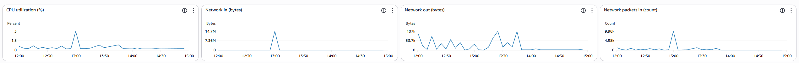

# Monitoring Challenge

## How to setup Detailed Monitoring
    1. Log in to AWS Management Console
    2. Navigate to Instance and find your App Instance
    3. Find Monitoring Tab
    4. click on manage monitoring and enable it 
    4. click on 3 dots and select add to dashboard
    5. you can create a new dashboard name for eg se-mab-test-dashboard
    6. Click on Save to save all the graphs and show the dashboard.

## How to create a CPU Usage alarm
    7. In Cloudwatch, navigate to Alarms
    8. Click Create Alarm
    9. Select Metric: EC2 > Per-Instance Metrics > CPUtilisation
    10. Define alarm conditions
        - Threshold: > 70%
        - Period: 1 minute
        - Evaluation: 1 
    11. Create new topic 'cpu-alert-topic'
        - add email address to your email
    12. Created the Alarm
    13. use command 'yes > /dev/null &' to create processes in the cpu to cause the alarm to run and use command 'killall yes' in order to stop the procceses

    13. email of the alarm being set off. 

